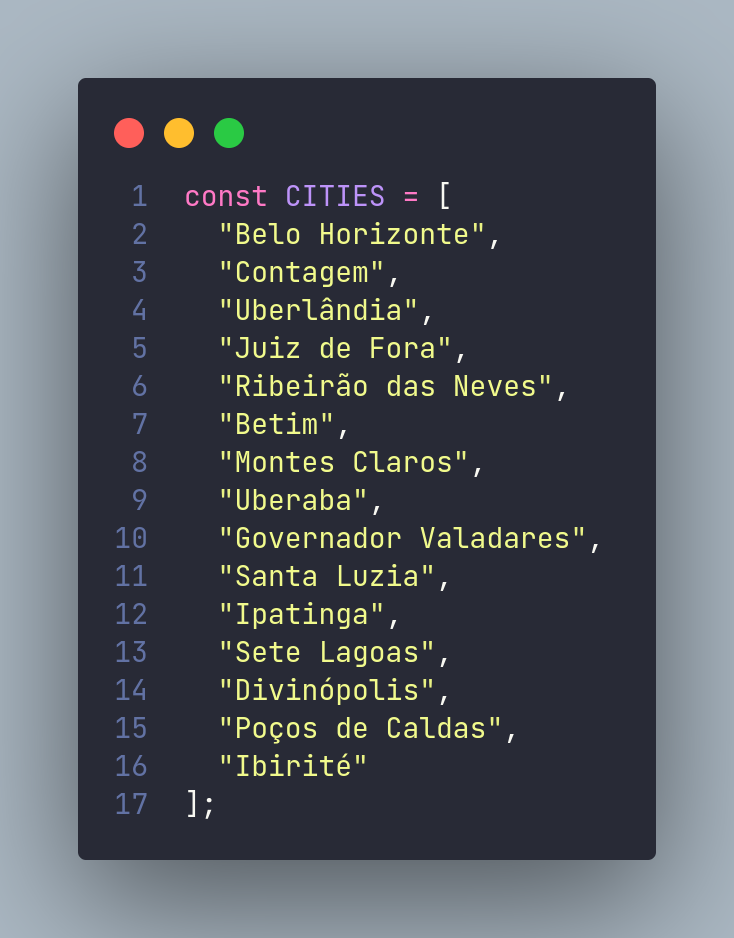
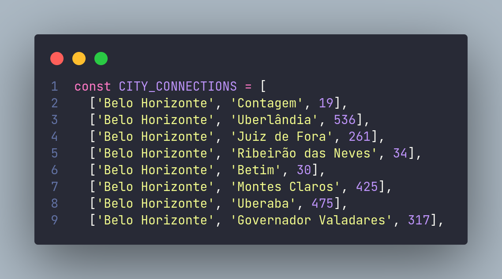
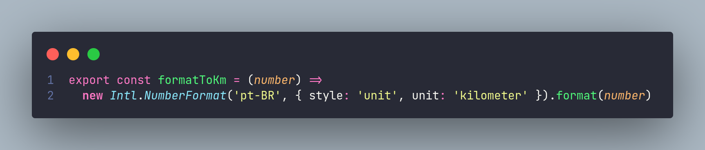
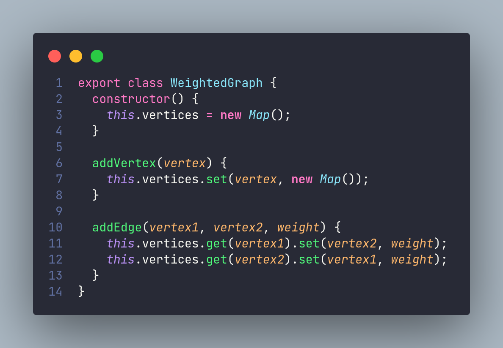
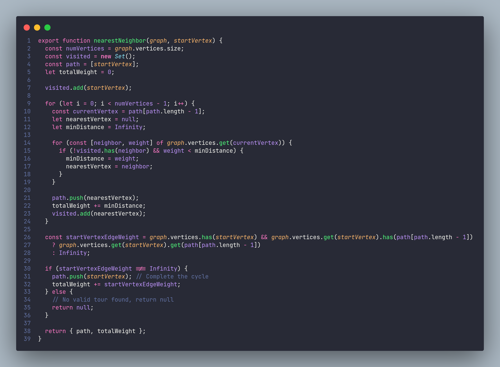
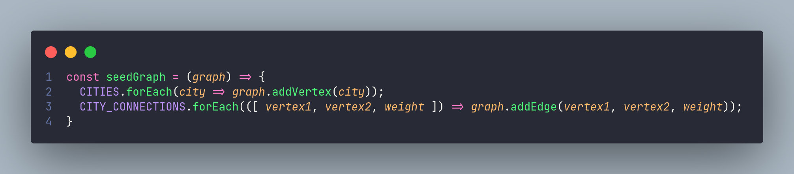
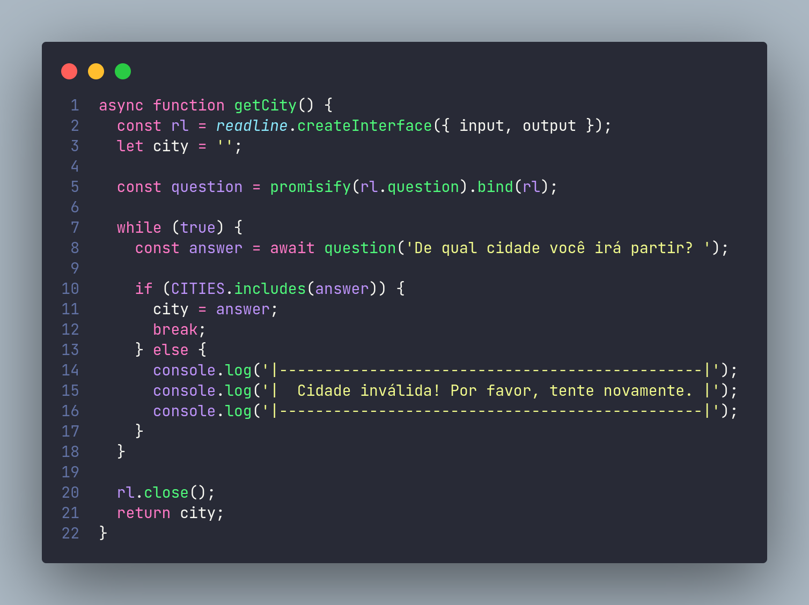
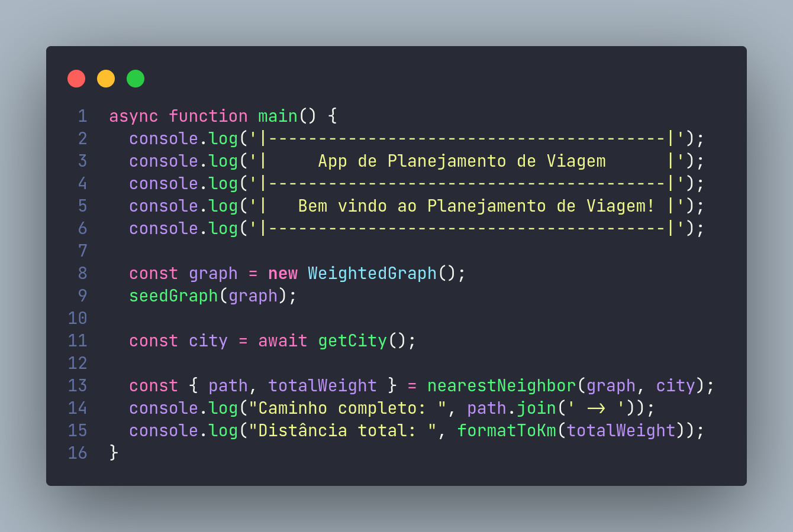

# Teoria de Grafos - Trabalho Final

## Alunos:

Camila Soares da Silva - RA: 12109716
Daniel Rabelo Chaves - RA: 12106756 
Raphael Javier Cardoso Marques - RA: 12109453                   
Yuri Italo - RA: 12109720

O algoritimo foi implementado utilizando a linguagem Javascript, com o intuito de resolver o problema proposto. Utilizei um algoritmo guloso para resolver o problema, um algoritmo guloso toma a decisão que parece ser a melhor no momento atual, sem considerar as possíveis consequências futuras. Escolhi o algoritmo do vizinho mais próximo, também conhecido como KNN, nesse algoritmo, um único caminho é construído começando pelo vértice inicial especificado pelo usuário. Ele encontra o vizinho mais próximo não visitado em cada etapa e continua construindo o caminho até que todos os vértices tenham sido visitados.

Abaixo segue imagens de como foi implementado o código:

### Arquivo const.js:

Esse arquivo contém as constantes utilizada no projeto, `CITY` são as cidades:

`CITY_CONNECTIONS` é um array com as conexões das cidades:
`[vertice1, vertice2, peso]`

Isso será utilizado para alimentar o grafo.

### Arquivo utils.js:

Contém funções utilitárias, como por exemplo a `formatToKm`, que pega um número e converte para KM.

### Arquivo graph.js:

Arquivo onde contém a classe `WeighteGraph`, que será utilizada para criar a instância do grafo. A classe cria um Map como vertices e contém dois métodos, um para adicionar aresta e outro para adicionar vértice.

### Arquivo NearestNeighbor.js:

Arquivo onde contém o algoritmo do vizinho mais próximo, ele recebe um grafo e um vértice inicial, roda o código e retorna um objeto do caminho completo e o peso total. Segue o passo a passo da implemetação do algoritmo:

1. O algoritmo recebe um grafo graph e um vértice inicial startVertex.
2. Ele inicializa variáveis, como o número total de vértices, um conjunto de vértices visitados, um array de caminho percorrido e a   variável totalWeight para acompanhar o custo total do caminho.
3. O vértice inicial é adicionado ao conjunto de visitados e ao caminho percorrido.
4. Em um loop que executa numVertices - 1 iterações (já que o primeiro vértice foi visitado anteriormente):
5. O vértice atual é obtido do último vértice adicionado ao caminho.
6. É inicializada uma variável nearestVertex para armazenar o vizinho mais próximo não visitado.
7. A distância mínima é inicializada como infinito.
8. Para cada vizinho do vértice atual no grafo, o algoritmo verifica se o vizinho não foi visitado e se a distância é menor que a distância mínima encontrada até o momento. Se essas condições forem atendidas, a distância mínima é atualizada e o vizinho mais próximo é atualizado.
9. O vizinho mais próximo é adicionado ao caminho percorrido, o custo é atualizado e o vizinho é marcado como visitado.
10. É verificado se existe uma aresta do último vértice do caminho ao vértice inicial. Se existir, essa aresta é adicionada ao caminho e o custo é atualizado.
11. Se não for possível completar o ciclo, significa que não foi encontrado um caminho válido, e o algoritmo retorna null.
12. Caso contrário, o algoritmo retorna o caminho percorrido e o custo total.

### Arquivo main.js:

Esse é o arquivo principal, onde o código é inicializado. Segue os métodos:

`seedGraph`, metódo para alimentar o grafo

`getCity`, método que utiliza a biblioteca `readline` do node para receber a cidade digitada pelo usuário

E por fim, main, onde o código é inicializado:

